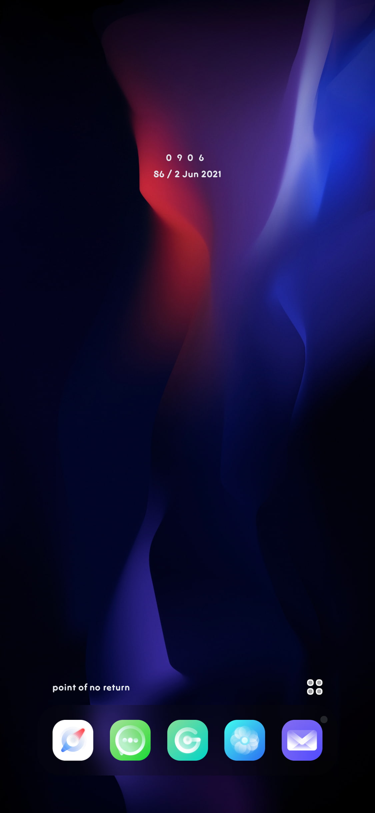
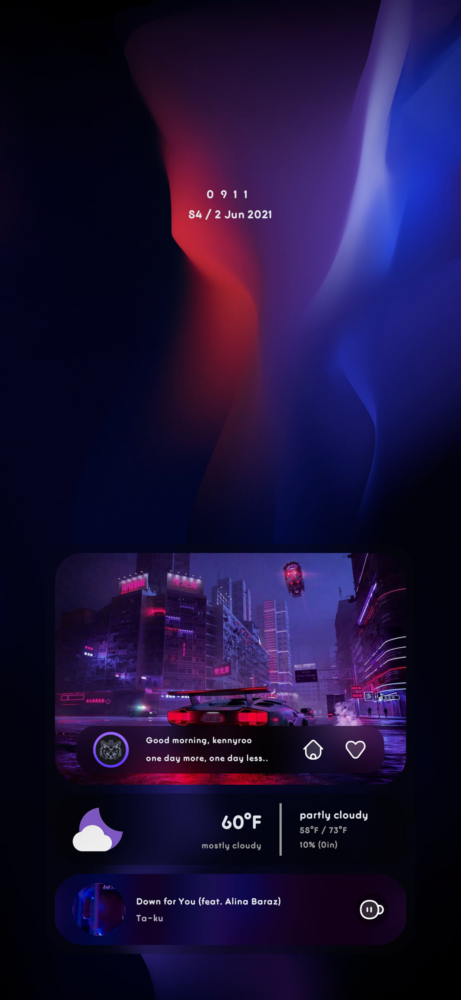
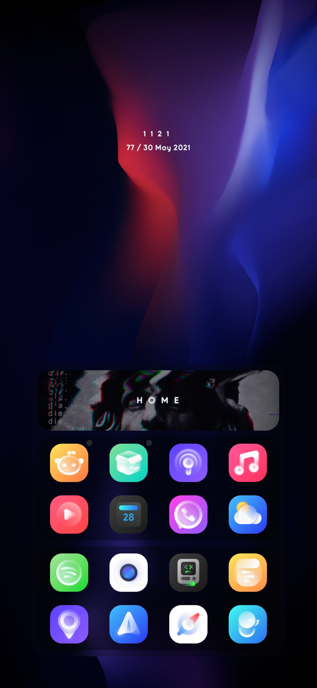

# HS | Cocoa Puffs

A neat & interactive widget wholly inspired by one of mocacocoa's KLWPs

  

### Prerequesites

> A jailbroken iPhone
>
> Xen HTML v2.0~release

### Install

This widget can be installed from [alo.works](https://alo.works) using your preferred package manager.

### Setup

For an optimal experience, please follow these steps:

  1. **Hide the dock**

  2. Move all icons on the **first page** of your homescreen to a different page

  3. Place widget in **Foreground Mode** on the homescreen's first page

### Customization

Here's a list of the customization options this widget offers:

#### Appearance

- Default theme colors
- Badge color
- Card radius
- Frosty theme & Frosty blur intensity

#### Custom Text & Typography

- Username
- Dock & Greet quote
- System font & font weight

If you want to change the pfp or any of the other images used (assuming this is on-device), they are located in /var/mobile/Library/Widgets/Homescreen/HS | Cocoa Puffs/assets/images. Just make sure the image you're replacing the original with has the same name.

### Troubleshooting

If you encounter any issues. I suggest first using the reset option in the widget settings. This resets the entire widget, including any apps you might've already set. If that doesn't solve the issue or you have some other complaint, you can file an issue here or dm me on [twitter](https://twitter.com/happysolucki).

### Note

This package only contains the widget. It's not responsible for any fonts, themes, or any other modifications shown in the screenshots.
